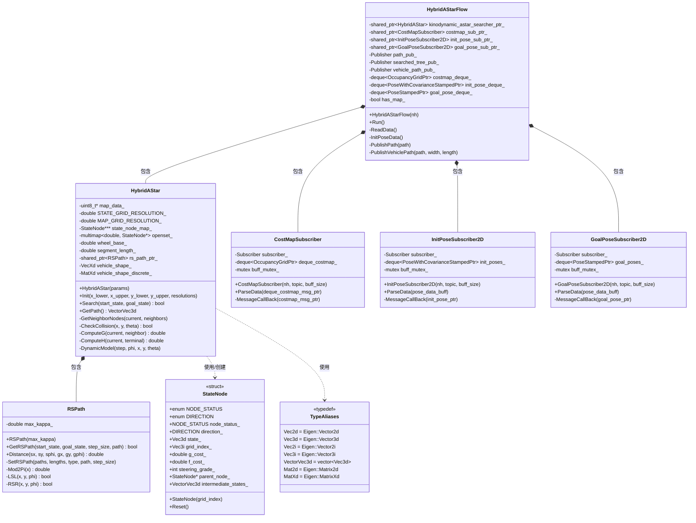

# Hybrid A* 项目类图说明

## 完整类图（Mermaid 格式）



## 类图详细说明

### 1. 类的表示

#### 类框结构
```
┌─────────────────────┐
│   类名 HybridAStar  │  ← 类名（斜体表示抽象类）
├─────────────────────┤
│ - map_data_         │  ← 属性（成员变量）
│ - openset_          │
├─────────────────────┤
│ + Search()          │  ← 方法（成员函数）
│ - ComputeH()        │
└─────────────────────┘
```

#### 访问修饰符
- `+` : public（公有）
- `-` : private（私有）
- `#` : protected（保护）

**对应源码：**
```cpp
class HybridAStar {
public:                          // + 公有
    bool Search(...);            // + Search()
    
private:                         // - 私有
    uint8_t* map_data_;          // - map_data_
    std::multimap<...> openset_; // - openset_
};
```

### 2. 类之间的关系

#### 关系类型图示

```
组合(Composition) - 实心菱形
HybridAStarFlow ♦━━━━ HybridAStar
"拥有"关系，生命周期一致

聚合(Aggregation) - 空心菱形  
Container ◇━━━━ Element
"包含"关系，生命周期独立

关联(Association) - 实线箭头
ClassA ────> ClassB
"使用"关系，持有引用

依赖(Dependency) - 虚线箭头
ClassA ····> ClassB
"使用"关系，临时使用

继承(Inheritance) - 空心三角
SubClass ━━▷ SuperClass
"是一个"关系
```

#### 本项目中的关系

**1. 组合关系（*--）**
```cpp
// HybridAStarFlow 包含 HybridAStar
class HybridAStarFlow {
    std::shared_ptr<HybridAStar> kinodynamic_astar_searcher_ptr_;
    // ↑ HybridAStarFlow 创建和拥有 HybridAStar
};
```

**2. 依赖关系（..>）**
```cpp
// HybridAStar 使用 StateNode
class HybridAStar {
    void GetNeighborNodes(..., std::vector<StateNode::Ptr>& neighbor_nodes) {
        auto node = new StateNode(...);  // 创建和使用
        neighbor_nodes.push_back(node);
    }
};
```

### 3. 核心类详解

#### 3.1 HybridAStar（算法核心）

**职责：** 实现 Hybrid A* 路径规划算法

**关键属性：**
```cpp
// 数据存储
- map_data_              // 障碍物地图（一维数组）
- state_node_map_        // 状态节点地图（三维数组）
- openset_               // 待扩展节点优先队列

// 参数配置
- wheel_base_            // 轴距
- segment_length_        // 扩展步长
- steering_radian_       // 最大转向角

// 辅助工具
- rs_path_ptr_           // Reeds-Shepp 路径生成器
- vehicle_shape_         // 车辆形状顶点
```

**关键方法：**
```cpp
+ Search()               // 主搜索函数
- GetNeighborNodes()     // 生成邻居节点
- CheckCollision()       // 碰撞检测
- ComputeG()            // 计算实际代价
- ComputeH()            // 计算启发式代价
```

**对应源码结构：**
```
include/hybrid_a_star/hybrid_a_star.h    (类声明)
src/hybrid_a_star.cpp                     (类实现)
```

#### 3.2 StateNode（状态节点）

**职责：** 表示搜索空间中的一个状态

**使用 struct 的原因：** 
- 所有成员都是公有的
- 主要用于数据存储

**关键属性：**
```cpp
+ state_                 // 连续状态 (x, y, θ)
+ grid_index_            // 离散索引 (i, j, k)
+ g_cost_                // 实际代价
+ f_cost_                // 总代价 = g + h
+ steering_grade_        // 转向档位
+ parent_node_           // 父节点（用于路径回溯）
+ intermediate_states_   // 中间状态序列
```

**枚举类型：**
```cpp
enum NODE_STATUS {
    NOT_VISITED = 0,
    IN_OPENSET = 1,
    IN_CLOSESET = 2
};

enum DIRECTION {
    FORWARD = 0,
    BACKWARD = 1,
    NO = 3
};
```

#### 3.3 HybridAStarFlow（流程控制）

**职责：** 
- ROS 节点管理
- 数据订阅和发布
- 调用 HybridAStar 进行规划

**关键属性：**
```cpp
// 算法对象
- kinodynamic_astar_searcher_ptr_    // Hybrid A* 算法

// ROS 订阅者
- costmap_sub_ptr_                   // 地图订阅
- init_pose_sub_ptr_                 // 起点订阅
- goal_pose_sub_ptr_                 // 终点订阅

// ROS 发布者
- path_pub_                          // 路径发布
- searched_tree_pub_                 // 搜索树可视化
- vehicle_path_pub_                  // 车辆轨迹可视化

// 数据缓存
- costmap_deque_                     // 地图消息队列
- init_pose_deque_                   // 起点消息队列
- goal_pose_deque_                   // 终点消息队列
```

**主要流程：**
```cpp
Run() {
    1. ReadData()              // 读取 ROS 消息
    2. 初始化地图
    3. while (有起点和终点) {
         InitPoseData()        // 获取起终点
         Search()              // 调用算法
         PublishPath()         // 发布结果
       }
}
```

#### 3.4 订阅者类（CostMapSubscriber 等）

**设计模式：** 观察者模式

**职责：** 
- 订阅 ROS 话题
- 缓存消息
- 提供消息给主程序

**通用结构：**
```cpp
class XXXSubscriber {
private:
    ros::Subscriber subscriber_;     // ROS 订阅者
    std::deque<MsgPtr> message_deque_; // 消息队列
    std::mutex buff_mutex_;          // 线程安全锁

    void MessageCallBack(msg_ptr) {  // 回调函数
        lock(buff_mutex_);
        message_deque_.push_back(msg_ptr);
        unlock(buff_mutex_);
    }

public:
    void ParseData(output_deque) {   // 取出消息
        lock(buff_mutex_);
        output_deque = message_deque_;
        message_deque_.clear();
        unlock(buff_mutex_);
    }
};
```

#### 3.5 RSPath（Reeds-Shepp 路径）

**职责：** 计算考虑车辆运动学约束的最短路径

**关键方法：**
```cpp
+ GetRSPath()      // 生成完整 RS 路径
+ Distance()       // 计算两点间 RS 距离
- LSL()            // 左-直-左曲线
- RSR()            // 右-直-右曲线
- ... (48种曲线类型)
```

### 4. 类图中的特殊符号

#### 多重性（Multiplicity）
```
1       : 恰好一个
0..1    : 零个或一个
*       : 零个或多个
1..*    : 一个或多个
```

**示例：**
```
HybridAStar "1" *-- "0..*" StateNode
(一个 HybridAStar 可以创建多个 StateNode)
```

#### 泛型（Templates）
```
multimap~double, StateNode*~
         ↑
      模板参数
```

**对应源码：**
```cpp
std::multimap<double, StateNode::Ptr> openset_;
```

### 5. 完整的交互流程

```
用户程序
   ↓
HybridAStarFlow.Run()
   ↓
┌─────────────────────────────────────┐
│ 1. 订阅者收集数据                   │
│    - CostMapSubscriber              │
│    - InitPoseSubscriber2D           │
│    - GoalPoseSubscriber2D           │
└─────────────────────────────────────┘
   ↓
┌─────────────────────────────────────┐
│ 2. HybridAStar.Init()               │
│    - 初始化地图                      │
│    - 分配内存                        │
└─────────────────────────────────────┘
   ↓
┌─────────────────────────────────────┐
│ 3. HybridAStar.Search()             │
│    ├─ GetNeighborNodes()            │
│    │   └─ DynamicModel()            │
│    │   └─ CheckCollision()          │
│    ├─ ComputeG()                    │
│    ├─ ComputeH()                    │
│    │   └─ RSPath.Distance()         │
│    └─ openset_ 管理                 │
└─────────────────────────────────────┘
   ↓
┌─────────────────────────────────────┐
│ 4. 发布结果                          │
│    - PublishPath()                  │
│    - PublishVehiclePath()           │
└─────────────────────────────────────┘
```

### 6. 学习建议

#### 如何阅读类图

1. **从整体到局部**
   - 先看有哪些主要的类
   - 再看类之间的关系
   - 最后看每个类的细节

2. **关注关系**
   - 实线 = 强关系（依赖、关联）
   - 虚线 = 弱关系（偶尔使用）
   - 箭头方向 = 依赖方向

3. **对照源码**
   - 类图中的每个元素都能在源码中找到
   - 类图是源码的可视化抽象

#### 练习任务

1. 找出 `HybridAStar` 类在源码中的位置
2. 确认 `StateNode` 的所有属性
3. 追踪 `HybridAStarFlow::Run()` 的调用链
4. 理解 `openset_` 的数据类型和用途

### 7. 类图工具推荐

- **PlantUML**: 文本描述生成类图
- **draw.io**: 可视化绘制
- **Mermaid**: Markdown 中嵌入（本文使用）
- **Visual Paradigm**: 专业 UML 工具

### 8. 术语对照表

| UML 术语 | 中文 | 源码示例 |
|---------|------|---------|
| Class | 类 | `class HybridAStar` |
| Attribute | 属性 | `double wheel_base_` |
| Method | 方法 | `bool Search()` |
| Composition | 组合 | `shared_ptr<HybridAStar>` |
| Dependency | 依赖 | `new StateNode()` |
| Association | 关联 | 持有指针/引用 |
| Multiplicity | 多重性 | `vector<StateNode*>` |

## 总结

这份类图展示了 Hybrid A* 项目的完整架构：

1. **核心算法层**: `HybridAStar`（算法实现）
2. **数据结构层**: `StateNode`（状态表示）
3. **应用层**: `HybridAStarFlow`（ROS 集成）
4. **工具层**: `RSPath`（路径计算）、订阅者类（数据采集）

通过这个类图，你可以：
- 快速理解项目结构
- 追踪代码调用关系
- 学习 UML 类图表示方法
- 为自己的项目设计类图

## 练习：尝试扩展类图

如果要添加新功能（如轨迹优化），思考：
1. 需要新建什么类？
2. 与哪些现有类交互？
3. 关系类型是什么？

这样你就能真正掌握类图的设计方法了！

